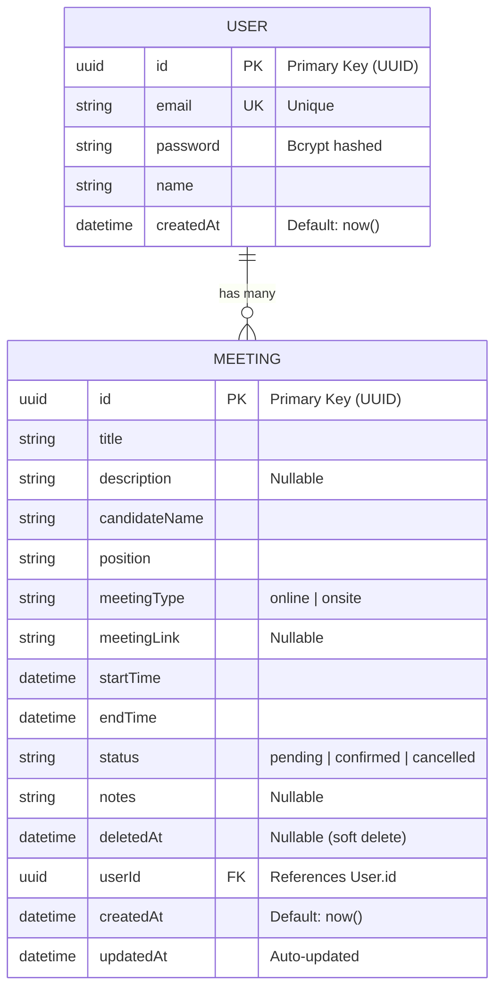

# Database ER Diagram — Candidate Meeting Scheduler

## Diagram

## Table Details

### User

| Column | Type | Constraints | Description |
|--------|------|-------------|-------------|
| id | UUID | PK, auto-generated | Unique identifier |
| email | String | Unique, Not Null | User's email address |
| password | String | Not Null | Bcrypt-hashed password (10 salt rounds) |
| name | String | Not Null | Display name |
| createdAt | DateTime | Default: now() | Account creation timestamp |

### Meeting

| Column | Type | Constraints | Description |
|--------|------|-------------|-------------|
| id | UUID | PK, auto-generated | Unique identifier |
| title | String | Not Null | Meeting title |
| description | String | Nullable | Optional description |
| candidateName | String | Not Null | Name of the candidate |
| position | String | Not Null | Job position being interviewed for |
| meetingType | String | Not Null | `online` or `onsite` |
| meetingLink | String | Nullable | URL for online meetings (e.g. Zoom link) |
| startTime | DateTime | Not Null | Meeting start date/time |
| endTime | DateTime | Not Null | Meeting end date/time |
| status | String | Default: `pending` | `pending`, `confirmed`, or `cancelled` |
| notes | String | Nullable | Internal notes |
| deletedAt | DateTime | Nullable | Soft delete timestamp (null = active) |
| userId | UUID | FK → User.id, Not Null | Owner of the meeting |
| createdAt | DateTime | Default: now() | Record creation timestamp |
| updatedAt | DateTime | Auto-updated | Last modification timestamp |

## Relationships

| Relationship | Type | Description |
|-------------|------|-------------|
| User → Meeting | One-to-Many | A user can have many meetings. Each meeting belongs to exactly one user. |

## Notes

- **Soft Delete**: Meetings are never physically deleted. The `deletedAt` field is set to the current timestamp, and queries filter out records where `deletedAt IS NOT NULL`.
- **UUID**: Both tables use UUID v4 as primary keys instead of auto-incrementing integers for better distributed system compatibility.
- **Password Security**: Passwords are hashed with bcrypt (10 salt rounds) before storage. Raw passwords are never persisted.
