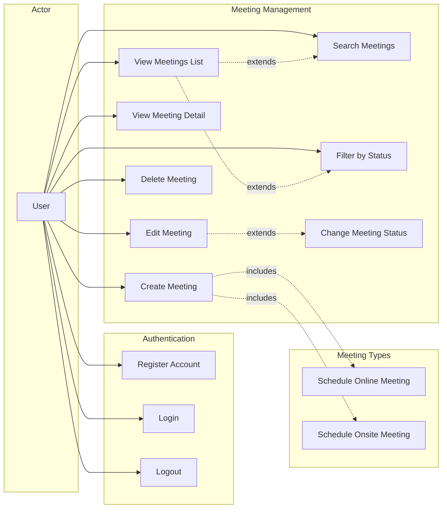

# Use Case Diagram — Candidate Meeting Scheduler

## Diagram

## Use Case Descriptions

### Authentication

| # | Use Case | Description | Precondition | Postcondition |
|---|----------|-------------|--------------|---------------|
| UC1 | Register Account | User creates a new account with name, email, and password | None | Account created, auto-signed-in, redirected to dashboard |
| UC2 | Login | User signs in with email and password | Account exists | JWT session created, redirected to dashboard |
| UC3 | Logout | User signs out of the application | Authenticated | Session cleared, redirected to login page |

### Meeting Management

| # | Use Case | Description | Precondition | Postcondition |
|---|----------|-------------|--------------|---------------|
| UC4 | Create Meeting | User schedules a new candidate meeting | Authenticated | Meeting created with status "pending" |
| UC5 | View Meetings List | User sees paginated list of their meetings | Authenticated | Dashboard displays meeting cards |
| UC6 | Search Meetings | User searches by title or candidate name | Authenticated, on dashboard | List filtered by search query |
| UC7 | Filter by Status | User filters meetings by pending/confirmed/cancelled | Authenticated, on dashboard | List filtered by selected status |
| UC8 | View Meeting Detail | User views full details of a meeting | Authenticated, meeting exists | Detail page with all fields displayed |
| UC9 | Edit Meeting | User modifies meeting fields | Authenticated, meeting exists | Meeting updated |
| UC10 | Delete Meeting | User soft-deletes a meeting (with confirmation) | Authenticated, meeting exists | Meeting marked as deleted |
| UC11 | Change Meeting Status | User changes status to confirmed or cancelled | Authenticated, editing meeting | Status updated |

### Meeting Types

| # | Use Case | Description |
|---|----------|-------------|
| UC12 | Schedule Online Meeting | Meeting type = "online", requires meeting link (e.g. Zoom URL) |
| UC13 | Schedule Onsite Meeting | Meeting type = "onsite", no meeting link required |
